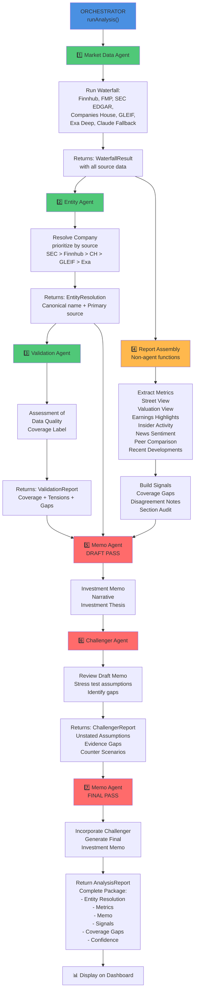

# Agent Orchestration Sequence

## Overview
This diagram shows how the **Orchestrator** (`runAnalysis()`) coordinates all agents during a company analysis workflow. Each agent runs in sequence, building on outputs from previous agents.

## Agent Execution Order

### Phase 1: Data Collection
1. **Market Data Agent** (`runWaterfall()`)
   - Fetches from 7 sources in parallel
   - Returns unified `WaterfallResult`

### Phase 2: Entity Resolution
2. **Entity Agent** (`buildEntityResolution()`)
   - Resolves to canonical company name
   - Priority: SEC > Finnhub > Companies House > GLEIF > Exa > Claude
   - Returns `EntityResolution` with all identifiers

3. **Validation Agent** (`validateWaterfall()`)
   - Assesses data quality
   - Flags tensions and gaps
   - Returns `ValidationReport`

### Phase 3: Report Assembly (Non-Agent)
4. **Report Functions** (10+ assembly functions)
   - Extract metrics, valuations, peer data
   - Build evidence signals
   - Identify coverage gaps

### Phase 4: AI Synthesis (Claude API)
5. **Memo Agent** - **DRAFT PASS** (`runMemoAgent()`)
   - Generates initial investment memo
   - Returns draft thesis

6. **Challenger Agent** (`runChallengerAgent()`)
   - Reviews draft for weak spots
   - Identifies assumptions and gaps
   - Returns challenger report

7. **Memo Agent** - **FINAL PASS** (`runMemoAgent()`)
   - Incorporates challenger feedback
   - Generates final investment memo
   - Returns complete narrative

## Typical Execution Time
- Market Data Agent: 1-2s
- Entity Resolution: <100ms
- Validation: <100ms
- Report Assembly: <200ms
- Draft Memo: 2-3s
- Challenger Review: 1-2s
- Final Memo: 2-3s
- **Total: ~7-12 seconds**

## Key Design Patterns
- **No hard failures**: Every agent has a fallback/empty result
- **Parallel data fetch**: All 7 sources fetch simultaneously
- **Staged synthesis**: Draft → Challenge → Final creates adversarial review
- **Composability**: Later agents consume outputs from earlier ones
