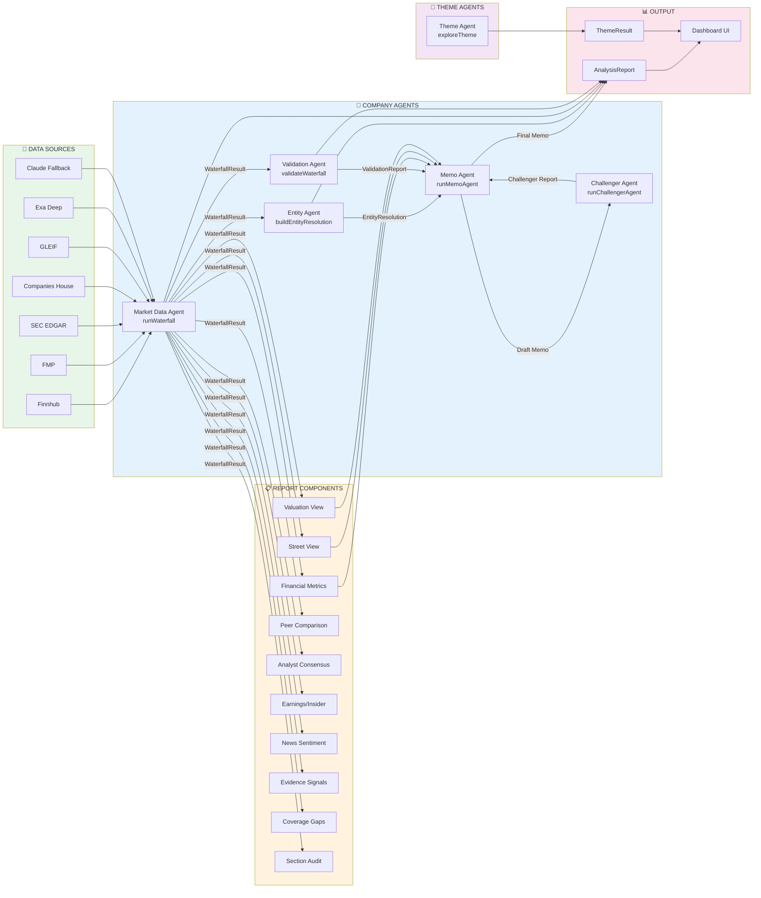

# System Architecture: Data Flow & Dependencies

## Overview
This diagram shows how all components (agents, data sources, reports) connect and flow through the system.

## Data Flow Summary

### 1. Data Sources Layer
All 7 sources are queried in parallel by the Market Data Agent:
- **Finnhub**: Market data, quotes, analyst ratings
- **FMP**: Financial metrics, peer data, historical multiples
- **SEC EDGAR**: US company filings, XBRL financials
- **Companies House**: UK company registry, accounts filings
- **GLEIF**: Global legal entity data
- **Exa Deep**: Private company research
- **Claude Fallback**: Web search synthesis (last resort)

### 2. Agents Layer

**Company Agents (5):**
1. **Market Data Agent** - Orchestrates waterfall, returns `WaterfallResult`
2. **Entity Agent** - Resolves to canonical name, returns `EntityResolution`
3. **Validation Agent** - Assesses quality, returns `ValidationReport`
4. **Memo Agent** - AI synthesis (runs twice: draft + final)
5. **Challenger Agent** - Stress tests assumptions

**Theme Agents (1):**
1. **Theme Agent** - Discovers themed companies via web search

### 3. Report Assembly Layer
Non-agent functions extract and structure data from `WaterfallResult`:
- **Financial Metrics**: Revenue, growth, margins, multiples
- **Street View**: Analyst consensus, price targets
- **Valuation View**: Current/forward P/E, EV/Sales, comparables
- **Peer Comparison**: Similar companies ranked
- **Analyst Consensus**: Buy/hold/sell ratings
- **Earnings/Insider**: Latest earnings, insider trading
- **News Sentiment**: Article tone, market mentions
- **Evidence Signals**: Key findings ranked by importance
- **Coverage Gaps**: Data limitations and blind spots
- **Section Audit**: Report quality assessment per section

### 4. Output Layer
- **AnalysisReport**: Complete structured report for companies
- **ThemeResult**: Themed companies with exposure scores
- **Dashboard UI**: Renders both reports to user

## Key Dependencies
- Market Data Agent must run first (all others depend on its output)
- Entity & Validation agents run in parallel (independent of each other)
- Report assembly happens after all agents finish
- Memo Agent (draft & final) requires Entity + Validation + Report data
- Challenger Agent depends on Memo Agent draft
- Theme Agent runs independently in separate API call

## Caching Strategy
- `AnalysisCache` table stores complete reports (15-min TTL by default)
- Report deltas compute differences from previous cached version
- Re-runs avoid redundant API calls if cache is fresh
