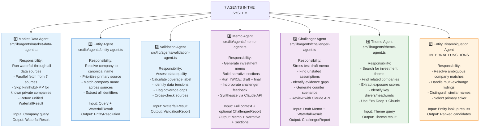

# Agent Responsibilities & Specifications

## Overview
Detailed breakdown of each of the 7 agents in the system, their responsibilities, inputs, outputs, and key logic.



## Agent Details

### 1. Market Data Agent
**File**: `src/lib/agents/market-data-agent.ts`

**Responsibilities**:
- Orchestrates the 7-source waterfall
- Fetches Finnhub, FMP, SEC EDGAR, Companies House, GLEIF, Exa Deep, Claude in parallel
- Skips Finnhub + FMP for known private companies (SpaceX, Stripe, Anthropic, etc.)
- Normalizes response shapes across different APIs
- Wraps results in typed `DataSourceResult`

**Key Logic**:
```
if (query is known private company):
  Finnhub = skip
  FMP = skip
  CH = skip (to avoid dormant UK matches)
else:
  Query all 7 sources in parallel
```

**Output**: `WaterfallResult` containing all source responses + `activeSources` array

---

### 2. Entity Agent
**File**: `src/lib/agents/entity-agent.ts`

**Responsibilities**:
- Resolve company to single canonical name
- Extract all identifiers (ticker, CIK, company number, ISIN, etc.)
- Determine primary data source (SEC > Finnhub > Companies House > GLEIF > Exa)
- Detect UK vs. US company vs. private company
- Filter out dormant/inactive entities

**Priority Order**:
1. SEC EDGAR name (if present) → PRIMARY = SEC
2. Finnhub name (if present) → PRIMARY = Finnhub
3. Companies House (if valid UK signals) → PRIMARY = Companies House
4. GLEIF (if present) → PRIMARY = GLEIF
5. Exa Deep (if present) → PRIMARY = Exa Deep
6. Claude Fallback (if present) → PRIMARY = Claude
7. Original query → PRIMARY = None

**Output**: `EntityResolution` with:
- `displayName`: Canonical company name
- `primarySource`: Which source won priority
- `identifiers`: All extracted IDs
- `confidence`: ★★★, ★★☆, or ★☆☆

---

### 3. Validation Agent
**File**: `src/lib/agents/validation-agent.ts`

**Responsibilities**:
- Assess data quality across all sources
- Calculate coverage label: "Robust", "Moderate", "Thin"
- Identify data tensions (conflicting evidence)
- Flag coverage gaps (missing categories)
- Cross-check source agreement

**Coverage Labels**:
- **Robust**: SEC filing + market data (Finnhub/FMP) + peer data
- **Moderate**: Market data only OR UK registry only
- **Thin**: Private company research only

**Output**: `ValidationReport` with:
- `coverageLabel`: Coverage level
- `dataQualityScore`: 0-100
- `tensions`: Conflicting data points
- `gaps`: Missing data category
- `crossChecks`: Source alignment notes

---

### 4. Memo Agent
**File**: `src/lib/agents/memo-agent.ts`

**Responsibilities**:
- Synthesize data into structured investment memo
- Build narrative sections (background, business model, financials, risks, thesis)
- **Runs TWICE**: Draft pass + final pass (after challenger review)
- Uses Claude API with structured output schema
- Incorporates challenger feedback in final pass

**Context Needed**:
- EntityResolution
- ValidationReport
- Metrics, Street View, Valuation View
- Evidence Signals, Coverage Gaps, Disagreement Notes
- (Optional) ChallengerReport (for final pass)

**Output**:
- `investmentMemo`: Recommendation score, conviction, role fit, verdict
- `narrative`: Prose synthesis of all signals
- `sections`: Structured narrative broken into sections

---

### 5. Challenger Agent
**File**: `src/lib/agents/challenger-agent.ts`

**Responsibilities**:
- Read draft memo and stress test it
- Identify unstated assumptions
- Find evidence gaps not addressed
- Generate counter scenarios
- Run adversarial review via Claude API

**This Agent Asks**:
- "What assumptions underpin this thesis?"
- "What data is missing?"
- "What would prove this thesis wrong?"
- "What's the bear case?"

**Output**: `ChallengerReport` with:
- `unstatedAssumptions`: Implicit premises
- `evidenceGaps`: Missing or weak signals
- `counterScenarios`: Bear/alternative cases

---

### 6. Theme Agent
**File**: `src/lib/agents/theme-agent.ts`

**Responsibilities**:
- Search for investment theme (e.g., "AI Acceleration")
- Use Exa Deep to find web articles + research
- Extract structured theme metadata
- Identify related companies with exposure scores
- Use Claude API structured extraction

**Workflow**:
1. Build query for Exa Deep
2. Execute deep web search
3. Extract top articles
4. Pass to Claude with JSON schema
5. Claude extracts: theme name, description, companies, drivers, headwinds, related themes
6. Normalize and sort companies by exposure score (0-100)
7. Return top 10

**Output**: `ThemeResult` with:
- `themeName`: Canonical theme name
- `themeDescription`: 2-3 sentence explanation
- `companies`: Array of {name, ticker, exposureScore, rationale}
- `keyDrivers`: 3-5 structural factors
- `headwinds`: 3-5 risks/obstacles
- `relatedThemes`: 3-5 adjacent themes

---

### 7. Entity Disambiguation (Internal)
**Embedded in**: `src/lib/agents/entity-agent.ts` and `src/lib/company-search.ts`

**Responsibilities**:
- Handle ambiguous company name matches
- Resolve multi-exchange listings (e.g., Shell trades on LSE + NYSE)
- Distinguish similar names (Apple Inc. vs. Apple Hospitality)
- Select primary ticker based on exchange priority
- Tier 0: US primary (NYSE/NASDAQ)
- Tier 1: Secondary (LSE, XETRA, etc.)
- Tier 2: ADR promotion for non-US primaries

**Output**: Ranked candidates before final resolution

---

## Agent Interaction Diagram

```
Market Data Agent (collects)
    ↓
Entity Agent (resolves)
    ↓
Validation Agent (inspects)
    ↓
Report Assembly (extracts)
    ↓
Memo Agent Draft (synthesizes)
    ↓
Challenger Agent (stress tests)
    ↓
Memo Agent Final (incorporates feedback)
    ↓
AnalysisReport (shipped to UI)
```

## Key Principles
- **No agent fails silently**: Every agent has fallback/empty result
- **Composable**: Output of one agent becomes input to next
- **Testable**: Each agent can be tested independently
- **Stateless**: Agents don't maintain internal state
- **Deterministic**: Same input → same output (except Claude API which may vary)
- **Auditable**: All results are logged and attributed to source
